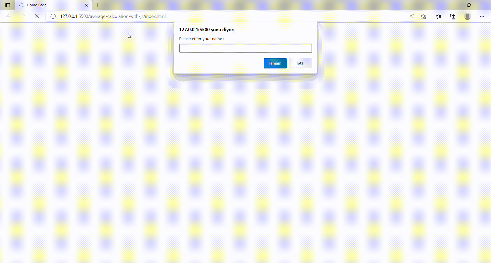

# Average calculator



## What is average calculator ?
```
It is a simple algorithm written in javascript to calculate college grades
```

## How the program works?
```
- 3 data entries are taken.
- letter grade is calculated by processing grade data
- Finally the outputs are shown on the page
```


## Used technologies


