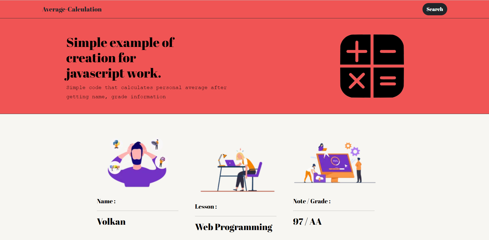
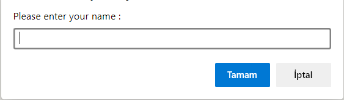
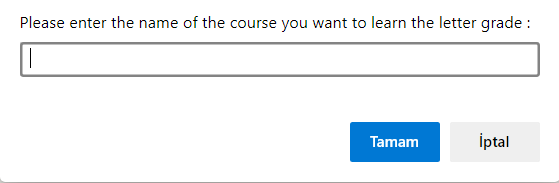
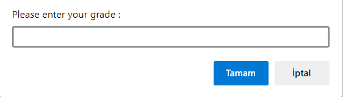

# Simple example of creation for javascript work

## How the program works?
* 3 data entries are taken.
* letter grade is calculated by processing grade data
* Finally the outputs are shown on the page

