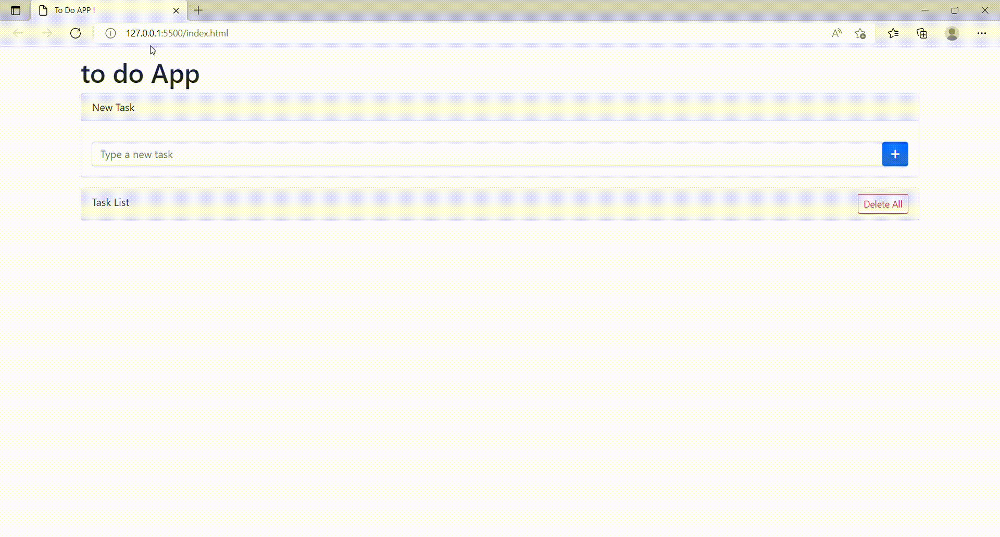

# To do list !


## Project Purpose
```
To apply the concept of local storage, which is often used in web projects.
Make clean code work
```

## Local Storage
```
It is a feature that allows JavaScript sites and applications to save key/value values ​​in a web browser without expiration date.
```

## What is to do list APP ?
```
to do list ; It is an idea developed to not forget and record the tasks that we feel responsible for doing daily.

It is a simple web project developed for repetition of learned skills.
```

## Used technologies


